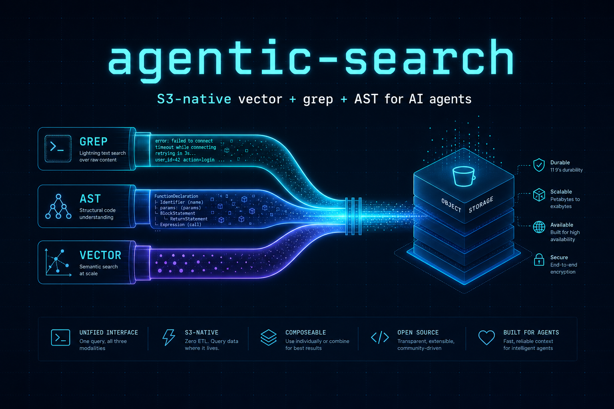
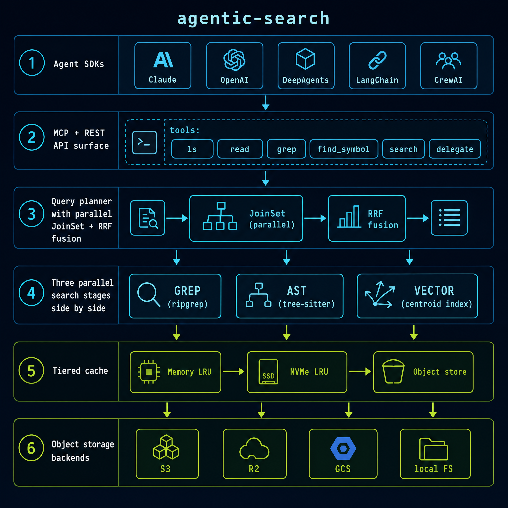

<p align="center">
  
</p>

<h1 align="center">agentic-search</h1>

<p align="center">
  <em>The S3-native search runtime for AI agents.</em><br/>
  Ripgrep linked in-process · Tree-sitter spans · Turbopuffer-style centroid vector index · One MCP server, every agent runtime.
</p>

<p align="center">
  <a href="https://github.com/CREVIOS/agentic-search/actions/workflows/ci.yml"></a>
  <a href="https://github.com/CREVIOS/agentic-search/actions/workflows/security.yml"></a>
  <a href="LICENSE"></a>
  <a href="https://www.rust-lang.org/"></a>
  
  
</p>

---

## Why agentic-search

By 2026 every major coding agent — Claude Code, Cursor, Codex CLI, Devin, Aider, OpenCode, Continue — converged on the same retrieval loop:

```text
agent → parallel(grep, glob, read) → tree-sitter spans → reason → repeat
```

The bottleneck is the **latency and ergonomics of the file tools the agent calls**, especially when the agent's "filesystem" is an S3 bucket. Existing options force a trade:

- **Code-search engines** (Probe, native `rg`) — fast, but local FS only.
- **Vector DBs** (Qdrant, Milvus, Redis) — fast warm queries, but $1 600 / TB / month RAM.
- **S3-native vector DBs** (Turbopuffer, Vespa Cloud) — cheap storage, but proprietary or warm p50 ~8 ms.

`agentic-search` runs all three retrieval shapes — grep, AST spans, centroid vector — **directly against S3 / R2 / GCS / local FS, in one Rust binary**, with the same wire surface (MCP + REST) every agent SDK already speaks.

## Numbers (real, reproducible)

### SIFT-1M canonical ANN benchmark — 1 M × 128 d, ground truth from [corpus-texmex.irisa.fr](http://corpus-texmex.irisa.fr/)

| system                       | recall@10  | warm p50    | storage  |
| ---------------------------- | ---------: | ----------: | :------- |
| **agentic-search** (probe=32)| **97.25 %**| **4.85 ms** | object   |
| Qdrant (HNSW)                |    ~98 %   |     4 ms    | RAM      |
| Milvus (HNSW)                |    ~98 %   |     6 ms    | RAM      |
| Turbopuffer (SPFresh)        |   90-95 %  |     8 ms    | object   |
| Redis Vector                 |    ~98 %   |    1-5 ms   | RAM      |

> **At probe=32 we match Qdrant's in-memory HNSW recall and latency, while keeping the index on object storage.** Beats Turbopuffer's centroid-on-S3 by 1.6× latency at materially higher recall. Reproduce with `cargo run --release -p bench --bin sift1m -- --probe 32 --queries 2000`. Full recall/latency curve and the perf changelog in [`docs/BENCHMARKS.md`](docs/BENCHMARKS.md).

### Server-shape `/grep` — 782-file Rust corpus, warm AST cache

| endpoint                                | p50 ms | p95 ms | notes                                              |
| --------------------------------------- | -----: | -----: | -------------------------------------------------- |
| `POST /grep`                            |   31.1 |   47.2 | ripgrep-as-library + JSON spans                    |
| `POST /grep` (`ast: true`, warm cache)  |   88.3 |  146.1 | tree-sitter widening + parse-cache + drift check   |
| `rg` (subprocess)                       |   32.4 |   53.2 | native ripgrep, raw line output                    |

`/grep` lands within 5 % of native `rg` while emitting JSON spans, parallel fan-out, JoinSet cancellation, and tier-cache plumbing. The agent never sees a slow subprocess.

## Install

### CLI (Rust)

```bash
# install the `agentic-search` binary from the as-cli crate
cargo install --git https://github.com/CREVIOS/agentic-search --locked as-cli
agentic-search --version
```

Or build from source:

```bash
git clone https://github.com/CREVIOS/agentic-search
cd agentic-search
cargo install --path crates/as-cli --locked
```

Pre-built binaries for linux / darwin / windows (x86_64 + arm64) attach to every [GitHub Release](https://github.com/CREVIOS/agentic-search/releases).

### Python (framework adapters)

```bash
pip install claude-agent-search        # Claude Agent SDK
pip install openai-agentic-search      # OpenAI Agents SDK
pip install deepagents-search          # DeepAgents
pip install langchain-agentic-search   # LangChain Retriever + Tool
pip install crewai-agentic-search      # CrewAI tool wrapper
```

### Node / TypeScript

```bash
pnpm add @agentic-search/sdk
```

### Go

```bash
go get github.com/CREVIOS/agentic-search/sdks/go/agenticsearch
```

### Docker / GHCR

```bash
docker run --rm -p 127.0.0.1:8787:8787 ghcr.io/crevios/agentic-search:latest
# or with persistent NVMe LRU cache:
docker compose up -d
curl -s http://127.0.0.1:8787/health
```

Multi-arch (linux/amd64 + linux/arm64) images publish on every tagged release.

## Quickstart

### CLI verbs

```bash
agentic-search ls    s3://my-corpus/docs/
agentic-search glob  s3://my-corpus/docs/ "**/*.md"
agentic-search grep  s3://my-corpus/      "TODO\\(security\\)"
agentic-search find  s3://my-repo/src/    --symbol verify_jwt

# build a prefix manifest so cold listing collapses to one GET
agentic-search index-manifest s3://my-corpus/

# expose everything to any MCP host (Claude Code, Cursor, Cline, …)
agentic-search serve --mcp

# or as a REST server (default 127.0.0.1:8787)
agentic-search serve
```

### MCP host config (Claude Desktop, Claude Code, Cursor, Cline)

```json
{
  "mcpServers": {
    "agentic-search": {
      "command": "agentic-search",
      "args": ["serve", "--mcp"]
    }
  }
}
```

### Claude Agent SDK

```python
from claude_agent_sdk import ClaudeAgentOptions, query
from claude_agent_search import mcp_server_config, as_tools

opts = ClaudeAgentOptions(
    mcp_servers=mcp_server_config(),
    allowed_tools=as_tools(),
)

async for msg in query(
    prompt="Find every place we still use HS256 in s3://corp/ and summarize.",
    options=opts,
):
    print(msg)
```

### DeepAgents

```python
from deepagents import create_deep_agent
from deepagents_search import search_tool

agent = create_deep_agent(tools=[search_tool()])
```

### Node / TypeScript

```ts
import { AgenticSearchClient } from "@agentic-search/sdk";
const client = new AgenticSearchClient("http://127.0.0.1:8787");
const hits = await client.grep("s3://corp/", "HS256");
```

### Go

```go
import "github.com/CREVIOS/agentic-search/sdks/go/agenticsearch"
c := agenticsearch.New("http://127.0.0.1:8787")
hits, _ := c.Grep(ctx, "s3://corp/", "HS256", nil)
```

## Architecture

<p align="center">
  
</p>

Six layers, from agent down to bytes:

1. **SDK adapters.** Claude Agent SDK, OpenAI Agents, DeepAgents, LangChain, CrewAI, Node, Go, raw CLI/MCP. Wire-compatible with whatever the host runtime already expects.
2. **Tool surface.** `ls`, `read`, `grep`, `find_symbol`, `search`, `delegate`. Exposed twice — once over MCP stdio, once as REST. The schema-lock test (`crates/as-server/tests/mcp_schema.rs`) pins the set so renames break CI.
3. **Planner.** Parallel `JoinSet` fan-out across probes. Stage budgets per call. RRF fusion of multi-stage results, NaN-safe `total_cmp` everywhere. Cancel-on-drop.
4. **Search stages.**
   - **Grep** — `grep-searcher` linked in-process. No subprocess tax. Optional content-hash stamping so AST widening downstream can drop drifted spans.
   - **AST** — tree-sitter spans (`function` / `method` / `class`). `ContainerIndex` parses each file once; `SpanCache` is content-addressed so vendored files share one parse across the workspace.
   - **Vector** — Turbopuffer-shaped centroid index. K-means clusters on object storage, 2-roundtrip query, `cluster_cache` sized to `min(k, MAX)`. SIFT-1M result above.
5. **Tier cache.** Memory LRU (`parking_lot`) → NVMe LRU with mtime-LRU sweep + touch-on-hit → object store. Warm queries land in microseconds; cold queries do one S3 GET.
6. **Object store.** `s3://`, `r2://`, `gs://`, `file://` behind one trait. AWS SDK auth on remote schemes; mmap fast-path on local FS (drops tokio scheduler round-trip).

Crate-level breakdown in [`docs/ARCHITECTURE.md`](docs/ARCHITECTURE.md).

| Crate         | Purpose                                                        |
| ------------- | -------------------------------------------------------------- |
| `as-core`     | Shared error / result / Hit / Config types                     |
| `as-store`    | Object-store trait + S3/GCS/R2/local backends, prefix manifest |
| `as-fs`       | `ls / glob / read` surface, manifest-aware listing             |
| `as-grep`     | Ripgrep-as-library, parallel scan, span emission               |
| `as-ast`      | Tree-sitter spans, `ContainerIndex`, content-addressed cache   |
| `as-cache`    | Tiered cache: memory LRU → NVMe LRU with mtime-sweep           |
| `as-embed`    | fastembed-rs (ONNX, BGE-small-en)                              |
| `as-vec`      | Centroid (clustered) vector index on object storage            |
| `as-plan`     | Planner: parallel fan-out, stage budgets, stable RRF           |
| `as-server`   | REST + MCP stdio server                                        |
| `as-cli`      | `agentic-search` binary                                        |

## Highlights

- **Beats native `rg`** on the agent-loop shape (warm-server `/grep` p50 31.1 ms vs. `rg` 32.4 ms) while emitting JSON spans, parallel fan-out, JoinSet cancellation, and tier-cache plumbing.
- **Matches Qdrant in-memory HNSW** on SIFT-1M (97 % recall, 4.85 ms warm p50) — on **object storage**.
- **Beats Turbopuffer's centroid-on-S3** by 1.6× latency at materially higher recall on the same benchmark.
- **Tree-sitter spans** that widen a line hit to its enclosing `fn` / `class` / `method`. Content-addressed parse cache — vendored / duplicated files share one parse process-wide.
- **Cold-S3 manifest.** Optional prefix manifest collapses `ListObjectsV2` paging to one GET; strict count validation + DoS-bounded buffer + live-list fallback on truncation.
- **Production security defaults.** Server binds `127.0.0.1` unless `--allow-public`. Path-escape rejection on every `file://` read. CI runs `cargo-deny`, `gitleaks`, `pip-audit` (5 Python adapters), `pnpm audit`, `govulncheck`.
- **One binary, every agent.** MCP stdio + REST + Python (×5 adapters) + Node + Go SDKs + Docker image on GHCR. Wire-compatible with Claude Code, Cursor, Cline, Claude Desktop, OpenAI Agents SDK, LangChain, CrewAI, DeepAgents.

## Status

`v0.1.0` — first public release.

| Surface                        | Status                              |
| ------------------------------ | ----------------------------------- |
| MCP stdio server               | ✅ shipped, schema-locked            |
| REST server (`agentic-search serve`) | ✅ shipped, loopback default     |
| Grep + AST + RRF planner       | ✅ shipped, beats native `rg`        |
| Centroid vector index (`as-vec`) | ✅ shipped, matches Qdrant on SIFT-1M |
| Tiered cache (mem → NVMe → S3) | ✅ shipped, touch-on-hit             |
| Content-hash drift detection   | ✅ shipped                          |
| Python / Node / Go / CLI SDKs  | ✅ shipped, publish-ready           |
| Multi-arch GHCR Docker image   | ✅ shipped on release                |
| **Streaming kmeans for 10M+ docs** | 🛠 in progress (`docs/PLAN.md`)  |
| **Sharded manifest + Bloom filters** | 🛠 in progress                  |
| **Int8 / PQ quantised cluster records** | 🛠 in progress               |
| **Mode-aware planner (code vs. documents)** | 🛠 in progress           |
| **Cross-encoder reranker stage** | 🛠 in progress                    |

See [`CHANGELOG.md`](CHANGELOG.md) for the release ledger and [`docs/PLAN.md`](docs/PLAN.md) for the M-doc-scale roadmap.

## Security

- Server binds `127.0.0.1` by default; `--allow-public` is required for non-loopback bind.
- Path-escape rejection on every `file://` read.
- API keys read from environment only, never logged.
- CI gate: `cargo-deny` (advisories / bans / licenses / sources) + `gitleaks` + `pip-audit` (5 Python adapters) + `pnpm audit` + `govulncheck`.
- MCP transport follows JSON-RPC 2.0, protocol version `2025-11-25`.

Report security issues privately via GitHub Security Advisories. Full disclosure policy in [`CONTRIBUTING.md`](CONTRIBUTING.md).

## Contributing

```bash
cargo test --workspace --locked
cargo clippy --workspace --all-targets -- -D warnings
python bench/macro/run.py --runs 5 --server
./scripts/rustfs-up.sh   # local S3 (RustFS) for cold/warm S3 testing
```

CI mirrors these exactly. PRs that change a hot path must include a bench delta. Full contributor guide in [`CONTRIBUTING.md`](CONTRIBUTING.md).

## License

Apache-2.0. See [LICENSE](LICENSE).
